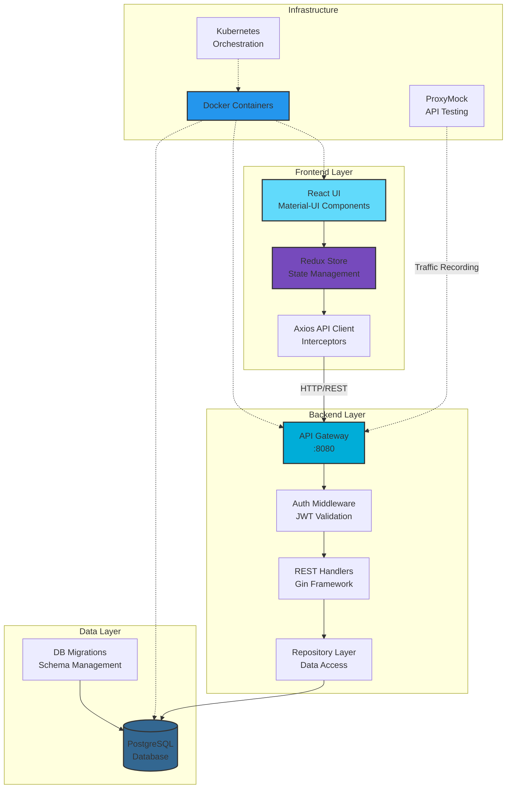

# CRM Demo Application

A modern, full-stack Customer Relationship Management (CRM) system built with Go, React, and PostgreSQL. This application provides a robust platform for managing customer relationships, tracking sales opportunities, and organizing business interactions through a clean, user-friendly interface.

## 🚀 Overview

This CRM demo showcases enterprise-grade architecture patterns and modern development practices. It features a RESTful API backend built with Go and Gin framework, a responsive React frontend with Material-UI, and PostgreSQL for reliable data persistence.

### Key Features

- **Account Management**: Track companies and organizations with detailed information
- **Contact Management**: Maintain comprehensive contact records linked to accounts
- **Opportunity Tracking**: Monitor sales pipeline with stage-based opportunity management
- **Notes System**: Flexible note-taking with multi-entity associations
- **Authentication**: JWT-based secure authentication system
- **Real-time Updates**: Responsive UI with Redux state management
- **API-First Design**: OpenAPI 3.0 specification for clear API contracts

## 🏗️ Architecture



### System Components

#### **Frontend (React + Redux)**
- Single Page Application with React Router
- Material-UI component library for consistent design
- Redux Toolkit for predictable state management
- Axios interceptors for API communication
- JWT token management for authentication

#### **Backend (Go + Gin)**
- RESTful API following OpenAPI 3.0 specification
- Repository pattern for clean data access
- JWT middleware for secure endpoints
- Database connection pooling
- Structured logging and error handling

#### **Database (PostgreSQL)**
- Normalized schema with foreign key constraints
- UUID primary keys for distributed systems compatibility
- Timestamp tracking for audit trails
- Migration-based schema management

## 📊 Data Model

The CRM system is built around four core entities:

- **Accounts**: Companies or organizations
- **Contacts**: Individual people associated with accounts
- **Opportunities**: Sales deals in various stages
- **Notes**: Flexible annotations linked to any entity

## 🛠️ Technology Stack

### Backend
- **Language**: Go 1.21+
- **Framework**: Gin Web Framework
- **Database**: PostgreSQL 15+
- **Authentication**: JWT (JSON Web Tokens)
- **API Documentation**: OpenAPI 3.0

### Frontend
- **Framework**: React 18
- **State Management**: Redux Toolkit
- **UI Components**: Material-UI v5
- **HTTP Client**: Axios
- **Routing**: React Router v6
- **Build Tool**: Create React App

### Infrastructure
- **Containerization**: Docker
- **Orchestration**: Kubernetes
- **API Testing**: ProxyMock for traffic recording/replay
- **Database Migrations**: golang-migrate

## 🚦 Getting Started

### Prerequisites
- Go 1.21 or higher
- Node.js 18+ and npm
- PostgreSQL 15+
- Docker and Docker Compose (optional)
- Make (for build commands)

### Quick Start

1. **Clone the repository**
   ```bash
   git clone https://github.com/kenahrens/crm-demo.git
   cd crm-demo
   ```

2. **Set up the database**
   ```bash
   make setup-db
   ```

3. **Start the backend**
   ```bash
   cd core-service
   make run
   ```

4. **Start the frontend** (in a new terminal)
   ```bash
   cd frontend
   npm install
   make start
   ```

5. **Access the application**
   - Frontend: http://localhost:3000
   - API: http://localhost:8080/v1/api

### Docker Deployment

Build and run with Docker Compose:
```bash
docker-compose up --build
```

## 📚 API Documentation

The API follows RESTful principles and is documented using OpenAPI 3.0. Key endpoints include:

- `POST /v1/api/auth/login` - User authentication
- `GET/POST /v1/api/accounts` - Account management
- `GET/POST /v1/api/contacts` - Contact management
- `GET/POST /v1/api/opportunities` - Opportunity tracking
- `GET/POST /v1/api/notes` - Note operations

Full API specification available at: `core-service/api/openapi/v1.yaml`

## 🧪 Testing

### Backend Tests
```bash
cd core-service
make test
```

### Frontend Tests
```bash
cd frontend
npm test
```

### API Testing with ProxyMock
The project includes ProxyMock integration for recording and replaying API traffic, enabling realistic testing scenarios and regression detection.

## 🔧 Development

### Code Style
- **Go**: Standard Go formatting with `gofmt`
- **React**: ESLint with react-app preset
- **Git**: Conventional commits recommended

### Project Structure
```
crm-demo/
├── core-service/          # Go backend service
│   ├── cmd/              # Application entrypoints
│   ├── pkg/              # Application packages
│   ├── db/migrations/    # Database migrations
│   └── api/openapi/      # API specifications
├── frontend/             # React frontend
│   ├── src/             # Source code
│   ├── public/          # Static assets
│   └── build/           # Production build
├── k8s/                 # Kubernetes manifests
└── docs/                # Additional documentation
```

## 🤝 Contributing

1. Fork the repository
2. Create a feature branch (`git checkout -b feature/amazing-feature`)
3. Commit your changes (`git commit -m 'Add amazing feature'`)
4. Push to the branch (`git push origin feature/amazing-feature`)
5. Open a Pull Request

## 📄 License

This project is licensed under the MIT License - see the [LICENSE](LICENSE) file for details.

## 🎯 Roadmap

- [ ] Advanced reporting and analytics dashboard
- [ ] Email integration for automated communications
- [ ] Mobile application support
- [ ] AI-powered lead scoring
- [ ] Multi-tenant architecture
- [ ] Advanced user roles and permissions
- [ ] Workflow automation engine

## 📞 Support

For questions, issues, or contributions:
- Create an issue in the GitHub repository
- Check existing documentation in `/docs`
- Review the API specification for integration questions

---

Built with ❤️ for the modern sales team