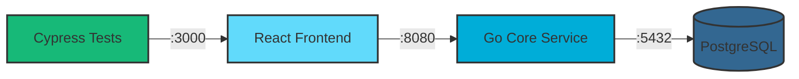
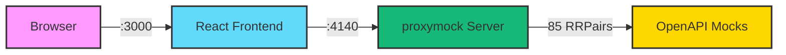
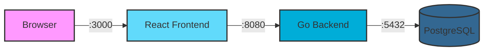

# CRM Demo Application

A modern, full-stack Customer Relationship Management (CRM) system built with Go, React, and PostgreSQL. This application provides a robust platform for managing customer relationships, tracking sales opportunities, and organizing business interactions through a clean, user-friendly interface.

## 🚀 Overview

This CRM demo showcases enterprise-grade architecture patterns and modern development practices. It features a RESTful API backend built with Go and Gin framework, a responsive React frontend with Material-UI, and PostgreSQL for reliable data persistence.

### Key Features

- **Full-Stack CRM**: Complete account, contact, and opportunity management with JWT authentication
- **Modern Tech Stack**: Go/Gin backend, React/Material-UI frontend, PostgreSQL database
- **API-First Design**: RESTful API with OpenAPI 3.0 specification
- **Progressive Testing with Mocks**: Comprehensive mocking strategy from OpenAPI-generated mocks to production traffic replay
  - **CRAWL**: Frontend development with synthetic mocks (no backend needed)
  - **WALK**: Automated UI tests + recorded golden workflows
  - **RUN**: Production traffic validation with automated regression detection
- **proxymock Integration**: Traffic recording, mocking, and replay for realistic testing (see [MOCKING.md](MOCKING.md) and [proxymock documentation](proxymock/instructions.md))

## 🚦 Prerequisites

- Go 1.21 or higher
- Node.js 18+ and npm
- PostgreSQL 15+
- Make (for build commands)

See [Architecture](#%EF%B8%8F-architecture) below for different ways to run this application.

## 📚 API Documentation

The API follows RESTful principles and is documented using OpenAPI 3.0. Key endpoints include:

- `POST /v1/api/auth/login` - User authentication
- `GET/POST /v1/api/accounts` - Account management
- `GET/POST /v1/api/contacts` - Contact management
- `GET/POST /v1/api/opportunities` - Opportunity tracking
- `GET/POST /v1/api/notes` - Note operations

Full API specification available at: `core-service/api/openapi/v1.yaml`

## 🧪 Testing

### Backend Tests
```bash
cd core-service
make test
```

### Frontend Tests
```bash
cd frontend
npm test
```

### Cypress End-to-End Tests
The project includes Cypress for end-to-end testing of the full application stack.

**Setup:**
```bash
cd frontend
npm install cypress --save-dev
```

**Run Cypress:**
```bash
# Open Cypress Test Runner (interactive mode)
cd frontend
npx cypress open

# Run Cypress tests headlessly
npx cypress run
```

**Writing Tests:**
Cypress tests are located in `frontend/cypress/e2e/`. Tests can interact with the full stack including frontend, backend, and database.

### Testing with Mocks: Progressive Methodology

This project demonstrates a progressive testing approach using proxymock, from initial development to production-grade validation.

#### 🐣 CRAWL: OpenAPI Mocks for Fast Development

**Goal:** Enable fast frontend development with no backend dependencies

```bash
# Start mock server with OpenAPI-generated mocks
proxymock mock --in-directory proxymock/generated-mocks

# Start frontend
./start-frontend-with-mocks.sh
```

**What you get:**
- 85 mock responses covering all 26 API endpoints
- All status codes (200, 201, 400, 404, 500, etc.)
- Instant feedback during UI development
- Contract validation against OpenAPI spec

**Manual testing checklist:**
- Login flows (valid/invalid credentials)
- CRUD operations for accounts, contacts, opportunities
- Error handling and edge cases
- Form validation and UI states

#### 🚶 WALK: Automated UI Tests + Golden Workflows

**Goal:** Automate testing and capture real workflows

```bash
# Run automated UI tests with mocks
./run-ui-tests-with-mocks.sh

# Record real workflows from live system
proxymock record --map 18080=http://localhost:8080 \
  --out proxymock/golden-workflows-$(date +%Y-%m-%d)

# Later: Replay to detect regressions
proxymock replay \
  --in proxymock/golden-workflows-2025-01-21 \
  --test-against http://localhost:8080 \
  --out proxymock/results/replay-$(date +%Y-%m-%d)
```

**What you find:**
- Automated regression detection in CI/CD
- API contract breakages (field changes, type mismatches)
- Response format changes
- Status code regressions

#### 🏃 RUN: Production Traffic for Real-World Testing

**Goal:** Fully automated testing with actual production patterns

```bash
# Pull production errors for investigation
proxymock pull --service crm-core \
  --filter-query '(status NOT "200")' \
  --start-time "$(date -u -v-1d +%Y-%m-%dT00:00:00Z)" \
  --snapshot-name "daily-errors" \
  --out proxymock/investigation-$(date +%Y-%m-%d)

# Replay against current code
proxymock replay \
  --in proxymock/investigation-* \
  --test-against http://localhost:8080
```

**What you find:**
- Real edge cases from actual users
- Data-specific bugs (Unicode, nulls, special characters)
- Performance issues with real data distributions
- Race conditions from concurrent usage patterns

**Automated workflows:**
- Daily production error checks (GitHub Actions cron)
- Pre-deployment validation against staging
- Continuous regression testing with live traffic
- Slack/email notifications on failures

See [MOCKING.md](MOCKING.md) for complete documentation including CI/CD integration examples and detailed workflows.

---

### API Testing with proxymock
The project includes proxymock integration for recording and replaying API traffic, enabling realistic testing scenarios and regression detection. See [proxymock documentation](proxymock/instructions.md) for detailed traffic recording workflows.

## 🔧 Development

### Code Style
- **Go**: Standard Go formatting with `gofmt`
- **React**: ESLint with react-app preset
- **Git**: Conventional commits recommended

### Project Structure
```
crm-demo/
├── core-service/          # Go backend service
│   ├── cmd/              # Application entrypoints
│   ├── pkg/              # Application packages
│   ├── db/migrations/    # Database migrations
│   └── api/openapi/      # API specifications
└── frontend/             # React frontend
    ├── src/             # Source code
    ├── public/          # Static assets
    └── build/           # Production build
```

## 🏗️ Architecture

This CRM can be run in several configurations, from baseline development to advanced testing scenarios with proxymock. See [proxymock documentation](proxymock/instructions.md) for advanced testing workflows.

### System Architecture Overview

The complete system architecture showing all components:



### 1. Frontend Development with OpenAPI Mocks (Recommended for UI Development)

Run the frontend with OpenAPI-generated mocks - no backend or database required:



**How to run:**

```bash
# Start the mock server with OpenAPI-generated mocks
proxymock mock --in-directory proxymock/generated-mocks

# Start the frontend configured to use mocks
./start-frontend-with-mocks.sh
```

**Access the application:**
- Frontend: http://localhost:3000
- Uses 85 mock RRPair files covering all 26 API endpoints

**Benefits:**
- Fast frontend development without backend dependencies
- Test all API scenarios including error responses (400, 404, 500)
- Consistent, predictable responses
- No database setup required

**Regenerating mocks when OpenAPI spec changes:**
```bash
proxymock generate --out proxymock/generated-mocks \
  --include-optional core-service/api/openapi/v1.yaml
```

See [MOCKING.md](MOCKING.md) for comprehensive mocking documentation including the Crawl → Walk → Run progressive testing methodology, CI/CD integration examples, and detailed workflows.

---

### 2. Baseline Development

The standard development setup with all services running locally:



**How to run:**

```bash
# Step 1: Clone the repository
git clone https://github.com/kenahrens/crm-demo.git
cd crm-demo

# Step 2: Set up PostgreSQL database
make setup-db

# Step 3: Start backend (Terminal 1)
cd core-service
make run

# Step 4: Start frontend (Terminal 2)
cd frontend
npm install
make start
```

**Access the application:**
- Frontend: http://localhost:3000
- API: http://localhost:8080/v1/api

**Login with demo users:**

The application comes pre-loaded with demo users (see Demo Data section below). Log in with:
- Email: `admin@example.com`
- Password: `password`

Or use any of the other demo user accounts (john.doe@example.com, jane.smith@example.com, etc.) with the same password.

**To create additional users manually:**

1. Temporarily disable auth as directed in `core-service/tests/test.http` (header comments), then restart the service
2. Create a user via API:
   ```bash
   curl -X POST http://localhost:8080/v1/api/users \
     -H 'Content-Type: application/json' \
     -d '{
       "username": "newuser",
       "email": "newuser@example.com",
        "password": "password",
       "role": "user"
     }'
   ```
3. Re-enable auth and restart the service

**Demo Data:**

The database is automatically seeded with demo data when you first run the application:

- **5 User Logins** - Ready to use for testing and demos
  - `admin@example.com` (admin role)
  - `john.doe@example.com` (user role)
  - `jane.smith@example.com` (user role)
  - `bob.wilson@example.com` (manager role)
  - `sarah.jones@example.com` (user role)
  - All passwords: `password`

- **20 Accounts** - Sample companies across various industries (Technology, Healthcare, Finance, etc.)
- **60 Contacts** - 3 contacts per account with realistic names and job titles
- **5 Opportunities** - Sales deals ranging from $50K to $250K in different stages
- **25 Notes** - Sample notes associated with accounts, contacts, and opportunities

This demo data is created automatically through database migrations and provides a realistic dataset for exploring the CRM functionality without manual data entry.

### Technology Stack

**Backend**: Go 1.21+, Gin Framework, PostgreSQL 15+, JWT Authentication

**Frontend**: React 18, Material-UI v5, Axios

**Testing**: Cypress for E2E tests, [proxymock documentation](proxymock/instructions.md) for traffic recording/replay/mocking

## 📊 Data Model

The CRM system manages four core entities:

- **Accounts**: Companies or organizations
- **Contacts**: Individual people associated with accounts
- **Opportunities**: Sales deals in various stages
- **Notes**: Flexible annotations linked to any entity

## 🎯 Mock Types Quick Reference

This project includes three types of mocks for different testing scenarios:

### 1. OpenAPI-Generated Mocks ✨
**Location:** `proxymock/generated-mocks/`
**Use for:** Initial UI development, contract validation, no backend available

```bash
proxymock mock --in-directory proxymock/generated-mocks
./start-frontend-with-mocks.sh
```

**Pros:** Complete API coverage, all status codes, fast regeneration
**Cons:** Synthetic data, not realistic workflows

### 2. Recorded Real Traffic 📹
**Location:** `proxymock/recorded-*/` or `proxymock/golden-workflows/`
**Use for:** Testing actual workflows, realistic data patterns, integration testing

```bash
# Record while using the app
proxymock record --map 18080=http://localhost:8080 --out proxymock/golden-workflows

# Replay to detect regressions
proxymock replay --in proxymock/golden-workflows --test-against http://localhost:8080
```

**Pros:** Real user interactions, actual data values, workflow sequences
**Cons:** Requires backend to record, limited to exercised flows

### 3. Production Traffic 🚀
**Location:** `proxymock/prod-traffic-samples/`
**Use for:** Finding edge cases, pre-deployment validation, investigating production issues

```bash
# Pull from production
proxymock pull --service crm-core \
  --filter-query '(status NOT "200")' \
  --start-time "$(date -u -v-1H +%Y-%m-%dT%H:%M:%SZ)" \
  --out proxymock/investigation
```

**Pros:** Real user patterns, actual edge cases, production data distributions
**Cons:** Requires proxymock cloud, may contain sensitive data

See [MOCKING.md](MOCKING.md) for detailed comparison and usage guidance.

## 🤝 Contributing

1. Fork the repository
2. Create a feature branch (`git checkout -b feature/amazing-feature`)
3. Commit your changes (`git commit -m 'Add amazing feature'`)
4. Push to the branch (`git push origin feature/amazing-feature`)
5. Open a Pull Request

## 📄 License

This project is licensed under the MIT License - see the [LICENSE](LICENSE) file for details.

## 🎯 Roadmap

- [ ] Advanced reporting and analytics dashboard
- [ ] Email integration for automated communications
- [ ] Mobile application support
- [ ] AI-powered lead scoring
- [ ] Multi-tenant architecture
- [ ] Advanced user roles and permissions
- [ ] Workflow automation engine

## 📞 Support

For questions, issues, or contributions:
- Create an issue in the GitHub repository
- Review the API specification for integration questions

---

Built with ❤️ for the modern sales team