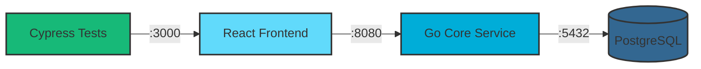
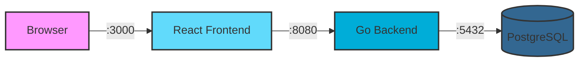

# CRM Demo Application

A modern, full-stack Customer Relationship Management (CRM) system built with Go, React, and PostgreSQL. This application provides a robust platform for managing customer relationships, tracking sales opportunities, and organizing business interactions through a clean, user-friendly interface.

## 🚀 Overview

This CRM demo showcases enterprise-grade architecture patterns and modern development practices. It features a RESTful API backend built with Go and Gin framework, a responsive React frontend with Material-UI, and PostgreSQL for reliable data persistence.

### Key Features

- **Full-Stack CRM**: Complete account, contact, and opportunity management with JWT authentication
- **Modern Tech Stack**: Go/Gin backend, React/Material-UI frontend, PostgreSQL database
- **API-First Design**: RESTful API with OpenAPI 3.0 specification
- **proxymock Integration**: Demonstrates traffic recording, mocking, and replay for advanced testing workflows (see [proxymock documentation](proxymock/instructions.md))

## 🚦 Prerequisites

- Go 1.21 or higher
- Node.js 18+ and npm
- PostgreSQL 15+
- Make (for build commands)

See [Architecture](#%EF%B8%8F-architecture) below for different ways to run this application.

## 📚 API Documentation

The API follows RESTful principles and is documented using OpenAPI 3.0. Key endpoints include:

- `POST /v1/api/auth/login` - User authentication
- `GET/POST /v1/api/accounts` - Account management
- `GET/POST /v1/api/contacts` - Contact management
- `GET/POST /v1/api/opportunities` - Opportunity tracking
- `GET/POST /v1/api/notes` - Note operations

Full API specification available at: `core-service/api/openapi/v1.yaml`

## 🧪 Testing

### Backend Tests
```bash
cd core-service
make test
```

### Frontend Tests
```bash
cd frontend
npm test
```

### Cypress End-to-End Tests
The project includes Cypress for end-to-end testing of the full application stack.

**Setup:**
```bash
cd frontend
npm install cypress --save-dev
```

**Run Cypress:**
```bash
# Open Cypress Test Runner (interactive mode)
cd frontend
npx cypress open

# Run Cypress tests headlessly
npx cypress run
```

**Writing Tests:**
Cypress tests are located in `frontend/cypress/e2e/`. Tests can interact with the full stack including frontend, backend, and database.

### API Testing with proxymock
The project includes proxymock integration for recording and replaying API traffic, enabling realistic testing scenarios and regression detection. See [proxymock documentation](proxymock/instructions.md) for detailed setup and usage instructions.

## 🔧 Development

### Code Style
- **Go**: Standard Go formatting with `gofmt`
- **React**: ESLint with react-app preset
- **Git**: Conventional commits recommended

### Project Structure
```
crm-demo/
├── core-service/          # Go backend service
│   ├── cmd/              # Application entrypoints
│   ├── pkg/              # Application packages
│   ├── db/migrations/    # Database migrations
│   └── api/openapi/      # API specifications
└── frontend/             # React frontend
    ├── src/             # Source code
    ├── public/          # Static assets
    └── build/           # Production build
```

## 🏗️ Architecture

This CRM can be run in several configurations, from baseline development to advanced testing scenarios with proxymock. See [proxymock documentation](proxymock/instructions.md) for advanced testing workflows.

### System Architecture Overview

The complete system architecture showing all components:



### 1. Baseline Development

The standard development setup with all services running locally:



**How to run:**

```bash
# Step 1: Clone the repository
git clone https://github.com/kenahrens/crm-demo.git
cd crm-demo

# Step 2: Set up PostgreSQL database
make setup-db

# Step 3: Start backend (Terminal 1)
cd core-service
make run

# Step 4: Start frontend (Terminal 2)
cd frontend
npm install
make start
```

**Access the application:**
- Frontend: http://localhost:3000
- API: http://localhost:8080/v1/api

**Create your first user:**

There is no default user. Create the first admin user:

1. Temporarily disable auth as directed in `core-service/tests/test.http` (header comments), then restart the service
2. Create the admin user via API:
   ```bash
   curl -X POST http://localhost:8080/v1/api/users \
     -H 'Content-Type: application/json' \
     -d '{
       "username": "admin",
       "email": "admin@example.com",
       "password": "adminpassword",
       "role": "admin"
     }'
   ```
3. Re-enable auth, restart the service, and log in with:
   - Email: `admin@example.com`
   - Password: `adminpassword`


### Technology Stack

**Backend**: Go 1.21+, Gin Framework, PostgreSQL 15+, JWT Authentication

**Frontend**: React 18, Material-UI v5, Axios

**Testing**: Cypress for E2E tests, [proxymock documentation](proxymock/instructions.md) for traffic recording/replay/mocking

## 📊 Data Model

The CRM system manages four core entities:

- **Accounts**: Companies or organizations
- **Contacts**: Individual people associated with accounts
- **Opportunities**: Sales deals in various stages
- **Notes**: Flexible annotations linked to any entity

## 🤝 Contributing

1. Fork the repository
2. Create a feature branch (`git checkout -b feature/amazing-feature`)
3. Commit your changes (`git commit -m 'Add amazing feature'`)
4. Push to the branch (`git push origin feature/amazing-feature`)
5. Open a Pull Request

## 📄 License

This project is licensed under the MIT License - see the [LICENSE](LICENSE) file for details.

## 🎯 Roadmap

- [ ] Advanced reporting and analytics dashboard
- [ ] Email integration for automated communications
- [ ] Mobile application support
- [ ] AI-powered lead scoring
- [ ] Multi-tenant architecture
- [ ] Advanced user roles and permissions
- [ ] Workflow automation engine

## 📞 Support

For questions, issues, or contributions:
- Create an issue in the GitHub repository
- Review the API specification for integration questions

---

Built with ❤️ for the modern sales team