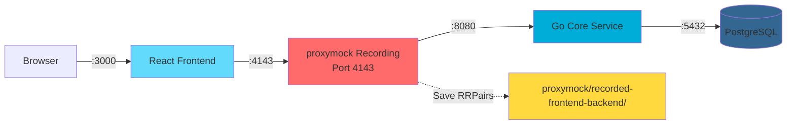
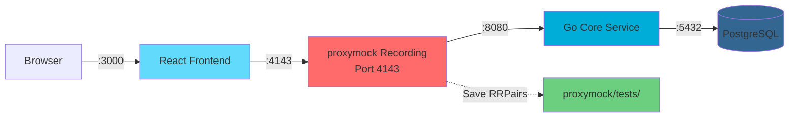
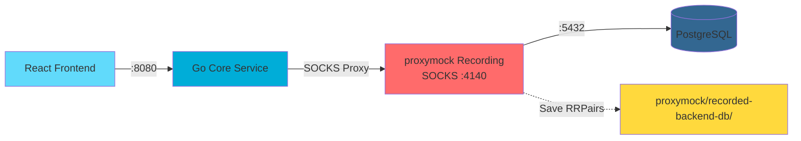
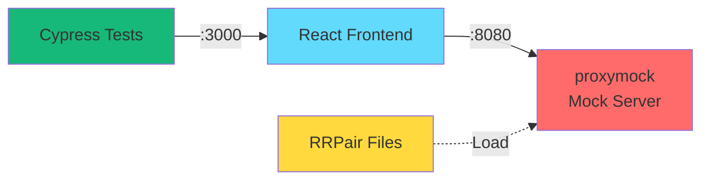
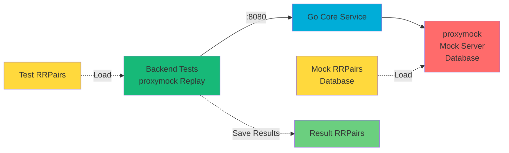

# Proxymock Traffic Capture Guide

This guide explains how to use proxymock to capture traffic in three distinct scenarios for the CRM demo application. proxymock enables traffic recording, mocking, and replay for advanced testing workflows.

## Introduction

proxymock is a powerful tool for recording, mocking, and replaying network traffic. In the CRM demo, it's used to:

- **Create service mocks**: Record API calls to create mock servers for frontend testing without a running backend
- **Generate test cases**: Record inbound requests to create test cases for backend integration testing
- **Mock database traffic**: Record database queries to enable backend testing without a real database

### Using Claude Code with proxymock

This documentation provides two ways to use proxymock:

1. **Claude Code (Recommended)**: Simply describe what you want to do in natural language, and Claude will execute the proxymock commands for you. For example:
   - "Start proxymock recording for frontend→backend traffic on port 4143"
   - "Stop the proxymock recording"
   - "Start a proxymock mock server using the recordings in proxymock/recorded-frontend-backend-<timestamp>"

2. **CLI**: Use the `proxymock` command directly in your terminal with the exact commands shown in the documentation.

Both methods achieve the same result - choose the one that's most convenient for your workflow.

## Architecture Overview

The three traffic capture scenarios serve different purposes:

1. **Frontend → Core Service (Outbound)**: Capture frontend API calls to create backend mocks for frontend testing
2. **Frontend → Core Service (Inbound)**: Capture requests to core-service to create test cases for backend testing  
3. **Core Service → PostgreSQL (Outbound)**: Capture database queries to create database mocks for backend testing

## Scenario 1: Frontend → Core Service (Outbound) - For Service Mocks

**Purpose**: Record frontend API calls so they can be mocked, allowing frontend development/testing without the backend running.

### Architecture



### Setup Steps

1. **Start PostgreSQL and Core Service**:
   ```bash
   # Terminal 1: Database
   make setup-db
   
   # Terminal 2: Backend (normal port 8080)
   cd core-service
   make run
   ```

2. **Start proxymock Recording**:
   - proxymock listens on port 4143 (proxy-in-port)
   - proxymock forwards to port 8080 (app-port where core-service runs)
   
   **Using Claude Code (recommended)**:
   In Claude Code, you can ask:
   > "Start proxymock recording for frontend→backend traffic. Listen on port 4143, forward to port 8080, and save recordings to proxymock/recorded-frontend-backend-<timestamp>"
   
   Claude will automatically execute the proxymock recording with the correct parameters.
   
   **Or via CLI**:
   ```bash
   proxymock record \
     --app-port 8080 \
     --proxy-in-port 4143 \
     --out proxymock/recorded-frontend-backend-$(date +%Y-%m-%d_%H-%M-%S)
   ```

3. **Configure Frontend to Use Proxy**:
   - Update `frontend/vite.config.mjs` to proxy `/v1/api` to `http://localhost:4143` instead of `http://localhost:8080`
   - Or set environment variable to override API base URL

4. **Start Frontend and Generate Traffic**:
   ```bash
   cd frontend
   make start
   # Use the application in browser - all API calls go through proxymock
   ```

5. **Stop Recording**:
   - **Using Claude Code**: Ask "Stop the proxymock recording" and Claude will stop it for you
   - **Or via CLI**: Press Ctrl+C or stop the proxymock process
   - RRPair files saved to `proxymock/recorded-frontend-backend-*/`

### Using the Recorded Mocks

Once you have recorded traffic, you can use it to mock the backend:

1. **Start Mock Server**:
   ```bash
   proxymock mock \
     --in proxymock/recorded-frontend-backend-<timestamp> \
     --port 8080
   ```

2. **Start Frontend**:
   - Ensure `frontend/vite.config.mjs` points to `http://localhost:8080` (or the mock server port)
   - Start the frontend: `cd frontend && make start`

3. **Run Tests**:
   - The frontend can now run against mocked backend responses
   - All API calls will return recorded responses from the RRPair files

## Scenario 2: Frontend → Core Service (Inbound) - For Test Cases

**Purpose**: Record requests coming INTO core-service to create test cases for backend integration testing.

### Architecture



### Setup Steps

1. **Same setup as Scenario 1** - proxymock records the same traffic
2. **Key Difference**: Save recordings to `proxymock/tests/` directory instead of `proxymock/recorded-frontend-backend-*/`

   **Using Claude Code**:
   In Claude Code, you can ask:
   > "Start proxymock recording for frontend→backend traffic. Listen on port 4143, forward to port 8080, and save recordings to proxymock/tests"
   
   **Or via CLI**:
   ```bash
   proxymock record \
     --app-port 8080 \
     --proxy-in-port 4143 \
     --out proxymock/tests
   ```

### Using Recorded Traffic for Testing

1. **Replay Test Traffic Against Backend**:
   ```bash
   proxymock replay \
     --in proxymock/tests \
     --test-against http://localhost:8080 \
     --out proxymock/replayed-$(date +%Y-%m-%d_%H-%M-%S)
   ```

2. **Compare Results to Detect Regressions**:
   ```bash
   proxymock compare \
     --in proxymock/tests \
     --in proxymock/replayed-<timestamp> \
     --verbosity 2
   ```

**Note**: The recording setup is identical to Scenario 1, but the purpose and output directory differ. The same RRPair files can serve both purposes - you can use them for mocking (Scenario 1) or for test cases (Scenario 2).

## Scenario 3: Core Service → PostgreSQL (Outbound) - For Database Mocks

**Purpose**: Record database queries from core-service so they can be mocked, allowing backend testing without a real database.

### Architecture



### Setup Steps

1. **Start PostgreSQL**:
   ```bash
   make setup-db
   ```

2. **Start proxymock Recording for Database**:
   - proxymock listens on port 4140 (proxy-in-port) as SOCKS proxy
   - proxymock forwards to port 5432 (app-port where PostgreSQL runs)
   
   **Using Claude Code**:
   In Claude Code, you can ask:
   > "Start proxymock recording for backend→database traffic. Listen on port 4140 as SOCKS proxy, forward to port 5432, and save recordings to proxymock/recorded-backend-db-<timestamp>"
   
   **Or via CLI**:
   ```bash
   proxymock record \
     --app-port 5432 \
     --proxy-in-port 4140 \
     --out proxymock/recorded-backend-db-$(date +%Y-%m-%d_%H-%M-%S)
   ```

3. **Start Core Service with SOCKS Proxy Environment Variables**:
   ```bash
   cd core-service
   export http_proxy=socks5h://localhost:4140
   export https_proxy=socks5h://localhost:4140
   export SSL_CERT_FILE=~/.speedscale/certs/tls.crt
   make run
   ```
   
   **Note**: PostgreSQL connections in Go typically use `lib/pq` or `pgx` which may need special configuration to use SOCKS proxy. You may need to configure connection pooling or use a proxy-aware driver. Consider using `golang.org/x/net/proxy` for SOCKS support.

4. **Generate Traffic**:
   - Start frontend or use API directly
   - All database queries from core-service go through proxymock

5. **Stop Recording**:
   - **Using Claude Code**: Ask "Stop the proxymock recording" and Claude will stop it for you
   - **Or via CLI**: Press Ctrl+C or stop the proxymock process
   - RRPair files saved to `proxymock/recorded-backend-db-*/`

### Using the Recorded Database Mocks

1. **Start Mock Server for Database**:
   ```bash
   proxymock mock \
     --in proxymock/recorded-backend-db-<timestamp> \
     --port 4140
   ```

2. **Start Backend with Proxied Database Connection**:
   ```bash
   cd core-service
   export http_proxy=socks5h://localhost:4140
   export https_proxy=socks5h://localhost:4140
   export SSL_CERT_FILE=~/.speedscale/certs/tls.crt
   make run
   ```

3. **Run Tests**:
   - Backend can now run against mocked database responses
   - All database queries will return recorded responses from the RRPair files

## Additional Scenarios: Replaying with Mock Servers

### Cypress Tests → Frontend → Mock Backend

Run Cypress end-to-end tests against the frontend with a mocked backend:



**How to run:**

**Using Claude Code**:
1. Ask Claude: "Start a proxymock mock server using recordings from proxymock/recorded-frontend-backend-<timestamp> on port 8080"
2. Start frontend: `cd frontend && make start`
3. Run Cypress tests: `cd frontend && npx cypress run` (or `npx cypress open` for interactive mode)

**Or via CLI**:
```bash
# Terminal 1: Start proxymock mock server
proxymock mock \
  --in proxymock/recorded-frontend-backend-<timestamp> \
  --port 8080

# Terminal 2: Start frontend
cd frontend
# Ensure API_BASE_URL points to http://localhost:8080/v1/api
npm install
make start

# Terminal 3: Run Cypress tests
cd frontend
npx cypress run
# Or open interactive mode: npx cypress open
```

Access at: http://localhost:3000 (backend is mocked)

### Backend Tests → Core Service → Mock Database

Run backend integration tests against the core service with a mocked database:



**How to run:**

**Using Claude Code**:
1. Ask Claude: "Start a proxymock mock server for database using recordings from proxymock/recorded-backend-db-<timestamp> on port 4140"
2. Start backend with proxied database connection (see CLI commands below)
3. Ask Claude: "Replay test traffic from proxymock/tests against http://localhost:8080 and save results to proxymock/replayed-<timestamp>"
4. Ask Claude: "Compare the test traffic in proxymock/tests with the replayed results in proxymock/replayed-<timestamp>"

**Or via CLI**:
```bash
# Terminal 1: Start proxymock mock server for database
proxymock mock \
  --in proxymock/recorded-backend-db-<timestamp> \
  --port 4140

# Terminal 2: Start backend with proxied database connection
cd core-service
export http_proxy=socks5h://localhost:4140
export https_proxy=socks5h://localhost:4140
export SSL_CERT_FILE=~/.speedscale/certs/tls.crt
make run

# Terminal 3: Replay test traffic against backend
proxymock replay \
  --in proxymock/tests \
  --test-against http://localhost:8080 \
  --out proxymock/replayed-$(date +%Y-%m-%d_%H-%M-%S)

# Compare results to detect regressions
proxymock compare \
  --in proxymock/tests \
  --in proxymock/replayed-<timestamp> \
  --verbosity 2
```

## Configuration Details

### Port Assignments

- **4143**: proxymock proxy for frontend→backend traffic (Scenarios 1 & 2)
- **4140**: proxymock SOCKS proxy for backend→database traffic (Scenario 3)
- **8080**: Core service API port
- **5432**: PostgreSQL port
- **3000**: Frontend dev server port

### Directory Structure

```
proxymock/
├── recorded-frontend-backend-YYYY-MM-DD_HH-MM-SS/  # Scenario 1: Frontend mocks
├── tests/                                            # Scenario 2: Test cases
├── recorded-backend-db-YYYY-MM-DD_HH-MM-SS/         # Scenario 3: Database mocks
└── replayed-YYYY-MM-DD_HH-MM-SS/                    # Replay results
```

### Configuration Files

#### Frontend Configuration (`frontend/vite.config.mjs`)

When recording frontend→backend traffic, update the proxy target:

```javascript
// Normal development
proxy: {
  '/v1/api': {
    target: 'http://localhost:8080',
    changeOrigin: true,
  }
}

// When recording with proxymock
proxy: {
  '/v1/api': {
    target: 'http://localhost:4143',  // proxymock port
    changeOrigin: true,
  }
}
```

#### Backend Configuration (`core-service/Makefile`)

The Makefile already includes `PROXYMOCK_ENV` variables for Scenario 3:

```makefile
PROXYMOCK_ENV = http_proxy=socks5h://localhost:4140 \
                https_proxy=socks5h://localhost:4140 \
                SSL_CERT_FILE=~/.speedscale/certs/tls.crt
```

Use these when starting the backend with proxied database connections.

## Troubleshooting

### PostgreSQL Proxy Support

Go database drivers (`lib/pq`, `pgx`) may not automatically use SOCKS proxy. You may need to:

- Configure connection pooling with proxy support
- Use a proxy-aware driver
- Consider using `golang.org/x/net/proxy` for SOCKS support
- Modify database connection strings to route through the proxy

### Frontend Proxy Configuration

If the frontend isn't routing through proxymock:

- Verify `vite.config.mjs` proxy target points to the correct proxymock port (4143)
- Check that proxymock is running on the expected port
- Ensure the frontend dev server is restarted after configuration changes

### Certificate Requirements

SOCKS proxy for database connections may require SSL certificates:

- Set `SSL_CERT_FILE` environment variable: `export SSL_CERT_FILE=~/.speedscale/certs/tls.crt`
- Ensure certificates are valid and accessible

### Traffic Separation

Use different output directories for different purposes:

- **Mocks**: `proxymock/recorded-frontend-backend-*/` or `proxymock/recorded-backend-db-*/`
- **Test cases**: `proxymock/tests/`
- **Replay results**: `proxymock/replayed-*/`

This helps organize traffic by purpose and makes it easier to find the right RRPair files.

## Best Practices

1. **Use Timestamped Directories**: Include timestamps in directory names to track when recordings were made
2. **Document Recording Context**: Note what features or workflows were tested during recording
3. **Version Control**: Consider committing RRPair files to version control for reproducible tests
4. **Regular Updates**: Update recordings when API contracts change
5. **Separate Concerns**: Use different directories for mocks vs test cases, even if recording the same traffic
6. **Clean Up**: Periodically remove old recordings to save disk space

## Related Documentation

- [README.md](../README.md) - Main project documentation
- [AGENTS.md](../AGENTS.md) - Guidelines for AI agents working with this repository

