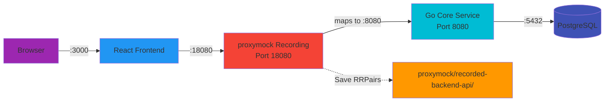
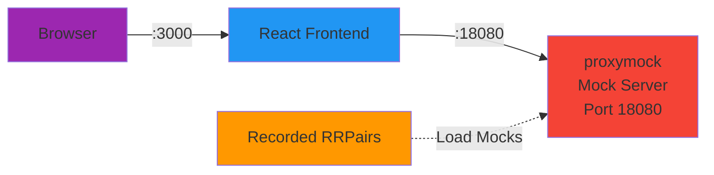
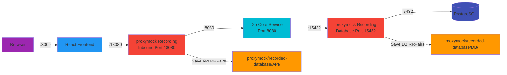
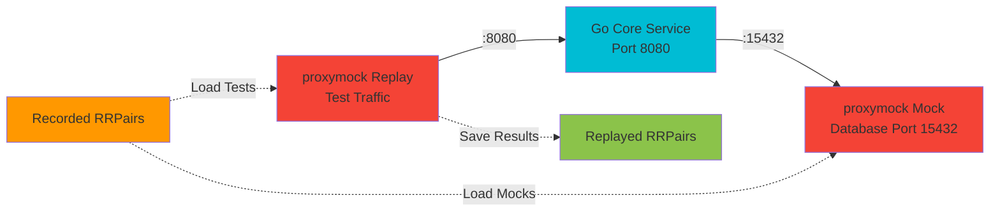

# Proxymock Traffic Capture Guide

This guide explains how to use proxymock to capture and replay traffic for the CRM demo application. proxymock enables comprehensive traffic recording, mocking, and replay for advanced testing workflows.

## Introduction

proxymock is a powerful tool for recording, mocking, and replaying network traffic. In the CRM demo, it's used for two main scenarios:

1. **Backend API Mocking**: Record frontend→backend traffic, then mock the backend for frontend testing
2. **Database Mocking**: Record backend→database traffic, then mock the database for backend testing

### Using Claude Code with proxymock

This documentation provides two ways to use proxymock:

1. **Claude Code (Recommended)**: Simply describe what you want to do in natural language, and Claude will execute the proxymock commands for you. For example:
   - "Start proxymock recording mapping port 18080 to http://localhost:8080"
   - "Stop the proxymock recording"
   - "Start a proxymock mock server using the recordings in proxymock/recorded-<timestamp>"

2. **CLI**: Use the `proxymock` command directly in your terminal with the exact commands shown in the documentation.

Both methods achieve the same result - choose the one that's most convenient for your workflow.

## Scenario 1: Backend API Mocking

**Purpose**: Record frontend API calls so they can be mocked, allowing frontend development and testing without running the real backend or database.

### Phase 1: Recording Backend API Traffic

#### Architecture



**How it works**:
- proxymock listens on port **18080** and maps to the core service on port **8080**
- Frontend sends API requests to port **18080**
- proxymock forwards requests to the core service on port **8080**
- Core service processes requests and queries the database
- proxymock saves all frontend↔backend request/response pairs

#### Recording Steps

1. **Start PostgreSQL**:
   ```bash
   make setup-db
   ```

2. **Start proxymock Recording**:

   **Using Claude Code (recommended)**:
   > "Start proxymock recording mapping port 18080 to http://localhost:8080, saving to proxymock/recorded-backend-api-<timestamp>"

   **Or via CLI**:
   ```bash
   proxymock record \
     --map 18080=http://localhost:8080 \
     --out proxymock/recorded-backend-api-$(date +%Y-%m-%d_%H-%M-%S)
   ```

   This command:
   - Listens on port 18080 and maps to port 8080
   - Captures all traffic between frontend and backend
   - Saves all API request/response pairs to the output directory

3. **Configure Frontend to Use Proxymock Port**:
   ```bash
   cd frontend
   export VITE_API_PORT=18080
   make start
   ```

4. **Generate Traffic**:
   - Open browser to http://localhost:3000
   - Use the application (create contacts, view lists, update data, etc.)
   - All API calls are recorded as RRPair files

5. **Stop Recording**:
   - **Using Claude Code**: "Stop the proxymock recording"
   - **Or via CLI**: Press Ctrl+C
   - RRPair files are saved to `proxymock/recorded-backend-api-*/`

### Phase 2: Mocking Backend API

Once you have recorded backend API traffic, you can mock the backend for frontend testing without running the real backend or database.

#### Architecture



**How it works**:
- proxymock mock server listens on port **18080**
- Frontend sends API requests to port **18080**
- proxymock returns recorded responses matching the request
- No real backend or database needed

#### Mocking Steps

**Using Claude Code**:
1. "Start a proxymock mock server using recordings from proxymock/recorded-backend-api-<timestamp> mapping port 18080 to http://localhost:8080"
2. Start frontend: `cd frontend && VITE_API_PORT=18080 make start`
3. Run tests: `cd frontend && npx cypress run`

**Or via CLI**:
```bash
# Terminal 1: Start mock server
proxymock mock \
  --in proxymock/recorded-backend-api-<timestamp> \
  --map 18080=http://localhost:8080

# Terminal 2: Start frontend
cd frontend
export VITE_API_PORT=18080
make start

# Terminal 3: Run Cypress tests (optional)
cd frontend
npx cypress run
```

**Result**: Frontend runs against mocked backend responses. No real backend or database needed.

## Scenario 2: Database Mocking for Backend Testing

**Purpose**: Record complete API workflows including database queries, then replay them against the backend with a mocked database for integration testing and regression detection.

### Phase 1: Recording Database Traffic

#### Architecture



**How it works**:
- proxymock listens on port **18080** for inbound API traffic and forwards to core service on port **8080**
- Core service is configured to connect to database on port **15432** (instead of 5432)
- proxymock listens on port **15432** for database traffic and forwards to PostgreSQL on port **5432**
- Both inbound API calls and outbound database queries are recorded as RRPair files

#### Recording Steps

1. **Start PostgreSQL**:
   ```bash
   make setup-db
   ```

2. **Start proxymock Recording for Database**:

   **Using Claude Code (recommended)**:
   > "Start proxymock recording mapping port 15432 to tcp://localhost:5432 for database traffic, saving to proxymock/recorded-database-<timestamp>"

   **Or via CLI**:
   ```bash
   # Terminal 1: Start proxymock for database traffic
   proxymock record \
     --map 15432=tcp://localhost:5432 \
     --out proxymock/recorded-database-$(date +%Y-%m-%d_%H-%M-%S)
   ```

3. **Start proxymock Recording for Inbound Traffic**:

   **Using Claude Code (recommended)**:
   > "Start proxymock recording on proxy-in-port 18080 with app-port 8080 and DB_PORT=15432, saving to proxymock/recorded-database-<timestamp>"

   **Or via CLI**:
   ```bash
   # Terminal 2: Start proxymock for inbound API traffic
   # Configure core service to use database port 15432
   DB_PORT=15432 proxymock record \
     --app-port 8080 \
     --proxy-in-port 18080 \
     --out proxymock/recorded-database-$(date +%Y-%m-%d_%H-%M-%S)
   ```

   Note: Both proxymock instances should write to the same output directory to keep all RRPairs together.

4. **Generate Traffic**:
   - Start frontend pointing to port 18080:
     ```bash
     cd frontend
     export VITE_API_PORT=18080
     make start
     ```
   - Open browser to http://localhost:3000
   - Use the application to trigger database queries
   - All API calls and database queries are recorded as RRPair files

5. **Stop Recording**:
   - **Using Claude Code**: "Stop the proxymock recording"
   - **Or via CLI**: Press Ctrl+C on both proxymock processes
   - RRPair files are saved to `proxymock/recorded-database-*/`

### Phase 2: Replaying Tests with Mocked Database

Once you have recorded traffic, you can replay the API requests against the backend with a mocked database for integration testing.

#### Architecture



**How it works**:
- proxymock mock server listens on port **15432** to intercept database calls
- proxymock replay sends recorded API requests to the core service on port **8080**
- Core service (configured for DB_PORT=15432) makes database queries to port **15432**
- proxymock mock returns recorded database responses matching the requests
- proxymock replay saves the actual responses for comparison

#### Replay/Testing Steps

**Using Claude Code**:
1. "Start a proxymock mock server for database using recordings from proxymock/recorded-database-<timestamp> mapping port 15432 to tcp://localhost:5432"
2. "Replay API traffic from proxymock/recorded-database-<timestamp> against http://localhost:8080 and save to proxymock/replayed-<timestamp>"
3. "Compare recorded traffic with replayed traffic to detect differences"

**Or via CLI**:
```bash
# Terminal 1: Start proxymock mock for database
proxymock mock \
  --in proxymock/recorded-database-<timestamp> \
  --map 15432=tcp://localhost:5432

# Terminal 2: Start core service with database pointing to proxymock
cd core-service
export DB_PORT=15432
make run

# Terminal 3: Replay API traffic
proxymock replay \
  --in proxymock/recorded-database-<timestamp> \
  --test-against http://localhost:8080 \
  --out proxymock/replayed-$(date +%Y-%m-%d_%H-%M-%S)

# Terminal 4: Compare results to detect regressions
proxymock compare \
  --in proxymock/recorded-database-<timestamp> \
  --in proxymock/replayed-<timestamp> \
  --verbosity 2
```

**Result**: API requests are replayed against the backend with mocked database responses. Differences between recorded and replayed traffic indicate potential regressions.

## Configuration Details

### Port Assignments

- **8080**: Core service API port
- **18080**: proxymock port for frontend→backend traffic (Scenarios 1 & 2)
- **5432**: PostgreSQL port
- **15432**: proxymock port for backend→database traffic (Scenario 2)
- **3000**: Frontend dev server port

### Directory Structure

```
proxymock/
├── recorded-backend-api-YYYY-MM-DD_HH-MM-SS/   # Scenario 1: Backend API recordings
├── recorded-database-YYYY-MM-DD_HH-MM-SS/      # Scenario 2: Database recordings
└── replayed-YYYY-MM-DD_HH-MM-SS/               # Replay results for comparison
```

### Environment Variables

#### Frontend Configuration

Use `VITE_API_PORT` to control which backend port the frontend connects to:

```bash
# Use live backend on port 8080
cd frontend
make start

# Use proxymock on port 18080 (Scenarios 1 & 2 - recording or mocking)
cd frontend
export VITE_API_PORT=18080
make start
```

The frontend `vite.config.mjs` should respect this environment variable:

```javascript
export default defineConfig({
  server: {
    proxy: {
      '/v1/api': {
        target: `http://localhost:${process.env.VITE_API_PORT || 8080}`,
        changeOrigin: true,
      }
    }
  }
})
```

## Troubleshooting

### Recording Not Capturing Database Traffic (Scenario 2)

If database queries aren't being recorded:

- Ensure proxymock is running on port 15432 with `--map 15432=tcp://localhost:5432`
- Verify the core service is configured with `DB_PORT=15432`
- Check that PostgreSQL is running on port 5432
- Review proxymock logs for database traffic capture

### Frontend Not Using Proxymock Port (Scenario 1)

If the frontend isn't routing through proxymock:

- Verify `VITE_API_PORT` environment variable is set to `18080`
- Check `vite.config.mjs` proxy configuration
- Restart the frontend dev server after changing environment variables
- Verify proxymock is running on port 18080

### Two Proxymock Instances Not Working Together (Scenario 2)

If you're having trouble recording both API and database traffic in Scenario 2:

- Both proxymock instances should write to the same output directory
- Start the database proxymock (port 15432) first, then the API proxymock (port 18080)
- Ensure the core service is configured with `DB_PORT=15432` when starting the API proxymock
- Check both proxymock processes are running: `ps aux | grep proxymock`
- Verify traffic is flowing through both by checking the output directory for RRPair files

### Port Conflicts

If you encounter "address already in use" errors:

- Ensure no other process is using the proxymock ports: 18080 or 15432 (Scenario 2)
- Stop any manually running core-service instances before starting proxymock
- Check PostgreSQL isn't bound to a conflicting port
- Use `lsof -i :<port>` to identify processes using specific ports (e.g., `lsof -i :18080`)

### Mock Server Not Matching Requests

If the mock server returns "no match" for requests:

- Ensure you're using the correct recorded directory with `--in`
- Verify the request path and method match what was recorded
- Check the mock server logs for matching details
- Try increasing verbosity: `proxymock mock --in ... --verbosity 2`

### Comparing Results Shows Unexpected Differences

If replay comparison shows differences:

- Check if timestamps or UUIDs are included in responses (expected differences)
- Verify the database state is similar to when traffic was recorded
- Use `--verbosity 3` for detailed diff output
- Review the specific RRPair files to understand what changed

## Best Practices

1. **Use Timestamped Directories**: Always include timestamps in directory names to track when recordings were made
2. **Document Recording Context**: Add a README in the recorded directory explaining what workflows were captured
3. **Version Control**: Commit representative RRPair files to version control for reproducible tests
4. **Regular Updates**: Re-record traffic when API contracts or database schemas change
5. **Clean Recordings**: Record focused workflows rather than random clicking to create meaningful test cases
6. **Separate Scenarios**: Keep Scenario 1 (API) and Scenario 2 (database) recordings in separate directories
7. **Review Before Committing**: Check recorded RRPairs for sensitive data before committing to version control

## Common Workflows

### Frontend Development (Scenario 1)

```bash
# 1. Record backend API traffic
proxymock record --map 18080=http://localhost:8080 --out proxymock/recorded-backend-api-$(date +%Y-%m-%d_%H-%M-%S)
# Generate traffic through frontend at port 18080, then stop recording

# 2. Develop frontend with mocked backend
proxymock mock --in proxymock/recorded-backend-api-<timestamp> --map 18080=http://localhost:8080
cd frontend && VITE_API_PORT=18080 make start
```

### Backend Development (Scenario 2)

```bash
# 1. Record API and database traffic
# Terminal 1: Record database traffic
proxymock record --map 15432=tcp://localhost:5432 --out proxymock/recorded-database-$(date +%Y-%m-%d_%H-%M-%S)

# Terminal 2: Record inbound API traffic
DB_PORT=15432 proxymock record --app-port 8080 --proxy-in-port 18080 --out proxymock/recorded-database-<same-timestamp>

# Terminal 3: Generate traffic through frontend
cd frontend && VITE_API_PORT=18080 make start
# Use the app, then stop both recordings

# 2. Test backend with mocked database
# Terminal 1: Start database mock
proxymock mock --in proxymock/recorded-database-<timestamp> --map 15432=tcp://localhost:5432

# Terminal 2: Start backend with mocked database
cd core-service && DB_PORT=15432 make run

# Terminal 3: Replay tests
proxymock replay --in proxymock/recorded-database-<timestamp> --test-against http://localhost:8080 --out proxymock/replayed-<timestamp>

# Terminal 4: Compare for regressions
proxymock compare --in proxymock/recorded-database-<timestamp> --in proxymock/replayed-<timestamp>
```

## Related Documentation

- [README.md](../README.md) - Main project documentation
- [AGENTS.md](../AGENTS.md) - Guidelines for AI agents working with this repository
