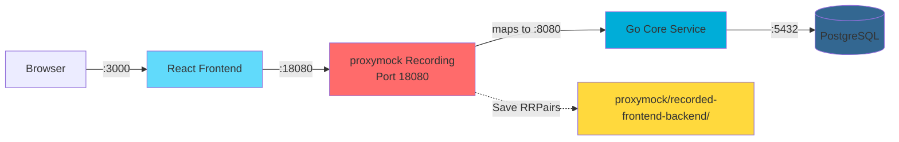
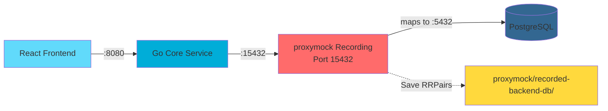
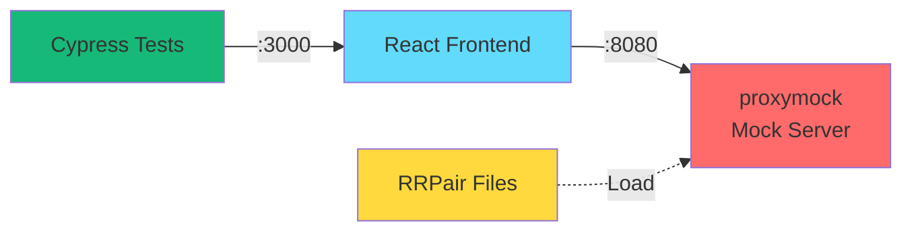
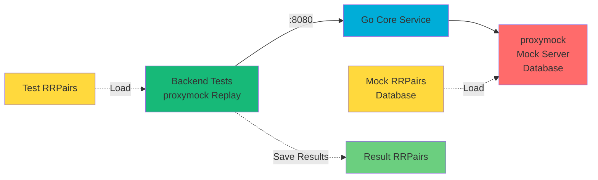

# Proxymock Traffic Capture Guide

This guide explains how to use proxymock to capture traffic in three distinct scenarios for the CRM demo application. proxymock enables traffic recording, mocking, and replay for advanced testing workflows.

## Introduction

proxymock is a powerful tool for recording, mocking, and replaying network traffic. In the CRM demo, it's used to:

- **Create service mocks**: Record API calls to create mock servers for frontend testing without a running backend
- **Generate test cases**: Record inbound requests to create test cases for backend integration testing
- **Mock database traffic**: Record database queries to enable backend testing without a real database

### Using Claude Code with proxymock

This documentation provides two ways to use proxymock:

1. **Claude Code (Recommended)**: Simply describe what you want to do in natural language, and Claude will execute the proxymock commands for you. For example:
   - "Start proxymock recording for frontend→backend traffic on port 4143"
   - "Stop the proxymock recording"
   - "Start a proxymock mock server using the recordings in proxymock/recorded-frontend-backend-<timestamp>"

2. **CLI**: Use the `proxymock` command directly in your terminal with the exact commands shown in the documentation.

Both methods achieve the same result - choose the one that's most convenient for your workflow.

## Architecture Overview

The three traffic capture scenarios serve different purposes:

1. **Frontend → Core Service (Outbound)**: Capture frontend API calls to create backend mocks for frontend testing
2. **Core Service → PostgreSQL (Outbound)**: Capture database queries to create database mocks for backend testing

## Scenario 1: Frontend → Core Service (Outbound) - For Service Mocks

**Purpose**: Record frontend API calls so they can be mocked, allowing frontend development/testing without the backend running.

### Architecture



### Setup Steps

1. **Start PostgreSQL and Core Service**:
   ```bash
   # Terminal 1: Database
   make setup-db
   
   # Terminal 2: Backend (normal port 8080)
   cd core-service
   make run
   ```

2. **Start proxymock Recording**:
   - proxymock listens on port 18080 and maps to port 8080 (where core-service runs)
   - Uses --map flag to create the port mapping

   **Using Claude Code (recommended)**:
   In Claude Code, you can ask:
   > "Start proxymock recording for frontend→backend traffic. Map port 18080 to http://localhost:8080 and save recordings to proxymock/recorded-frontend-backend-<timestamp>"

   Claude will automatically execute the proxymock recording with the correct parameters.

   **Or via CLI**:
   ```bash
   proxymock record \
     --map 18080=http://localhost:8080 \
     --out proxymock/recorded-frontend-backend-$(date +%Y-%m-%d_%H-%M-%S)
   ```

3. **Configure Frontend to Use Proxymock Port**:
   - Set `VITE_API_PORT` environment variable to `18080` to use proxymock recording
   - Or update `frontend/vite.config.mjs` to proxy `/v1/api` to `http://localhost:18080` instead of `http://localhost:8080`
   - The environment variable approach makes it easy to swap between live (8080) and proxymock (18080) ports

4. **Start Frontend and Generate Traffic**:
   ```bash
   cd frontend
   make start
   # Use the application in browser - all API calls go through proxymock
   ```

5. **Stop Recording**:
   - **Using Claude Code**: Ask "Stop the proxymock recording" and Claude will stop it for you
   - **Or via CLI**: Press Ctrl+C or stop the proxymock process
   - RRPair files saved to `proxymock/recorded-frontend-backend-*/`

### Using the Recorded Mocks

Once you have recorded traffic, you can use it to mock the backend:

1. **Start Mock Server**:
   ```bash
   proxymock mock \
     --in proxymock/recorded-frontend-backend-<timestamp> \
     --map 18080=http://localhost:8080
   ```

   Note: The mock server listens on port 18080. You can optionally use `--map 8080=http://localhost:8080` if you want the mock server to listen on the same port as the real backend.

2. **Start Frontend**:
   - Set `VITE_API_PORT=18080` to use the mock server port
   - Or ensure `frontend/vite.config.mjs` points to `http://localhost:18080`
   - Start the frontend: `cd frontend && make start`

3. **Run Tests**:
   - The frontend can now run against mocked backend responses
   - All API calls will return recorded responses from the RRPair files

## Scenario 2: Core Service → PostgreSQL (Outbound) - For Database Mocks

**Purpose**: Record database queries from core-service so they can be mocked, allowing backend testing without a real database.

### Architecture



### Setup Steps

1. **Start PostgreSQL**:
   ```bash
   make setup-db
   ```

2. **Start proxymock Recording for Database**:
   - proxymock listens on port 15432 and maps to port 5432 (where PostgreSQL runs)
   - Uses --map flag to create the port mapping

   **Using Claude Code**:
   In Claude Code, you can ask:
   > "Start proxymock recording for backend→database traffic. Map port 15432 to http://localhost:5432 and save recordings to proxymock/recorded-backend-db-<timestamp>"

   **Or via CLI**:
   ```bash
   proxymock record \
     --map 15432=http://localhost:5432 \
     --out proxymock/recorded-backend-db-$(date +%Y-%m-%d_%H-%M-%S)
   ```

3. **Start Core Service with Database Connection to Proxymock Port**:
   ```bash
   cd core-service
   # Configure database connection to use port 15432 instead of 5432
   export DB_PORT=15432
   make run
   ```

   **Note**: Update your database connection configuration to use the proxymock port (15432) instead of the live PostgreSQL port (5432). The connection string should point to `localhost:15432`.

4. **Generate Traffic**:
   - Start frontend or use API directly
   - All database queries from core-service go through proxymock

5. **Stop Recording**:
   - **Using Claude Code**: Ask "Stop the proxymock recording" and Claude will stop it for you
   - **Or via CLI**: Press Ctrl+C or stop the proxymock process
   - RRPair files saved to `proxymock/recorded-backend-db-*/`

### Using the Recorded Database Mocks

1. **Start Mock Server for Database**:
   ```bash
   proxymock mock \
     --in proxymock/recorded-backend-db-<timestamp> \
     --map 15432=http://localhost:5432
   ```

2. **Start Backend with Proxied Database Connection**:
   ```bash
   cd core-service
   export DB_PORT=15432
   make run
   ```

3. **Run Tests**:
   - Backend can now run against mocked database responses
   - All database queries will return recorded responses from the RRPair files

## Additional Scenarios: Replaying with Mock Servers

### Cypress Tests → Frontend → Mock Backend

Run Cypress end-to-end tests against the frontend with a mocked backend:



**How to run:**

**Using Claude Code**:
1. Ask Claude: "Start a proxymock mock server using recordings from proxymock/recorded-frontend-backend-<timestamp> mapping port 18080 to http://localhost:8080"
2. Start frontend with `VITE_API_PORT=18080`: `cd frontend && VITE_API_PORT=18080 make start`
3. Run Cypress tests: `cd frontend && npx cypress run` (or `npx cypress open` for interactive mode)

**Or via CLI**:
```bash
# Terminal 1: Start proxymock mock server
proxymock mock \
  --in proxymock/recorded-frontend-backend-<timestamp> \
  --map 18080=http://localhost:8080

# Terminal 2: Start frontend
cd frontend
# Set environment variable to use proxymock port
export VITE_API_PORT=18080
npm install
make start

# Terminal 3: Run Cypress tests
cd frontend
npx cypress run
# Or open interactive mode: npx cypress open
```

Access at: http://localhost:3000 (backend is mocked)

### Backend Tests → Core Service → Mock Database

Run backend integration tests against the core service with a mocked database:



**How to run:**

**Using Claude Code**:
1. Ask Claude: "Start a proxymock mock server for database using recordings from proxymock/recorded-backend-db-<timestamp> mapping port 15432 to http://localhost:5432"
2. Start backend with proxied database connection (see CLI commands below)
3. Ask Claude: "Replay test traffic from proxymock/tests against http://localhost:8080 and save results to proxymock/replayed-<timestamp>"
4. Ask Claude: "Compare the test traffic in proxymock/tests with the replayed results in proxymock/replayed-<timestamp>"

**Or via CLI**:
```bash
# Terminal 1: Start proxymock mock server for database
proxymock mock \
  --in proxymock/recorded-backend-db-<timestamp> \
  --map 15432=http://localhost:5432

# Terminal 2: Start backend with proxied database connection
cd core-service
export DB_PORT=15432
make run

# Terminal 3: Replay test traffic against backend
proxymock replay \
  --in proxymock/tests \
  --test-against http://localhost:8080 \
  --out proxymock/replayed-$(date +%Y-%m-%d_%H-%M-%S)

# Compare results to detect regressions
proxymock compare \
  --in proxymock/tests \
  --in proxymock/replayed-<timestamp> \
  --verbosity 2
```

## Configuration Details

### Port Assignments

- **8080**: Core service API port (live backend)
- **18080**: proxymock port for frontend→backend traffic (Scenarios 1 & 2)
- **5432**: PostgreSQL port (live database)
- **15432**: proxymock port for backend→database traffic (Scenario 3)
- **3000**: Frontend dev server port

### Directory Structure

```
proxymock/
├── recorded-frontend-backend-YYYY-MM-DD_HH-MM-SS/  # Scenario 1: Frontend mocks
├── tests/                                            # Scenario 2: Test cases
├── recorded-backend-db-YYYY-MM-DD_HH-MM-SS/         # Scenario 3: Database mocks
└── replayed-YYYY-MM-DD_HH-MM-SS/                    # Replay results
```

### Configuration Files

#### Frontend Configuration (`frontend/vite.config.mjs`)

Use environment variable to easily switch between live and proxymock ports:

```javascript
export default defineConfig({
  server: {
    proxy: {
      '/v1/api': {
        target: `http://localhost:${process.env.VITE_API_PORT || 8080}`,
        changeOrigin: true,
      }
    }
  }
})
```

Usage:
- **Live backend**: `make start` (uses port 8080 by default)
- **Proxymock backend**: `VITE_API_PORT=18080 make start` (uses port 18080)

#### Backend Configuration (`core-service/Makefile`)

For Scenario 3 (database mocking), configure the database port via environment variable:

```bash
# Use live database (default)
make run

# Use proxymock database
DB_PORT=15432 make run
```

The backend should be configured to read `DB_PORT` from the environment and default to 5432 if not set.

## Troubleshooting

### Database Connection Configuration

To use proxymock with the database, update your database connection string to use port 15432:

- Configure the backend to read `DB_PORT` from environment variables
- Set `DB_PORT=15432` when running with proxymock database mocking
- Ensure the connection string uses `localhost:15432` instead of `localhost:5432`

### Frontend Proxy Configuration

If the frontend isn't routing through proxymock:

- Verify `VITE_API_PORT` environment variable is set to `18080`
- Or verify `vite.config.mjs` proxy target points to the correct proxymock port (18080)
- Check that proxymock is running on the expected port
- Ensure the frontend dev server is restarted after configuration changes

### Port Conflicts

If you encounter port conflicts:

- Ensure the live service isn't running on the proxymock port
- Check that no other processes are using ports 18080 or 15432
- Use `lsof -i :18080` or `lsof -i :15432` to identify processes using these ports

### Traffic Separation

Use different output directories for different purposes:

- **Mocks**: `proxymock/recorded-frontend-backend-*/` or `proxymock/recorded-backend-db-*/`
- **Test cases**: `proxymock/tests/`
- **Replay results**: `proxymock/replayed-*/`

This helps organize traffic by purpose and makes it easier to find the right RRPair files.

## Best Practices

1. **Use Timestamped Directories**: Include timestamps in directory names to track when recordings were made
2. **Document Recording Context**: Note what features or workflows were tested during recording
3. **Version Control**: Consider committing RRPair files to version control for reproducible tests
4. **Regular Updates**: Update recordings when API contracts change
5. **Separate Concerns**: Use different directories for mocks vs test cases, even if recording the same traffic
6. **Clean Up**: Periodically remove old recordings to save disk space

## Related Documentation

- [README.md](../README.md) - Main project documentation
- [AGENTS.md](../AGENTS.md) - Guidelines for AI agents working with this repository

